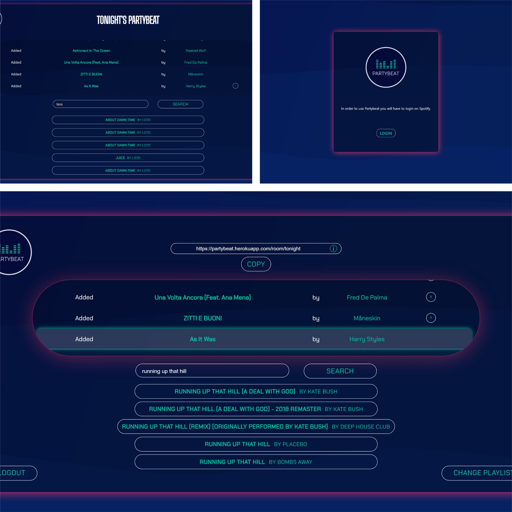
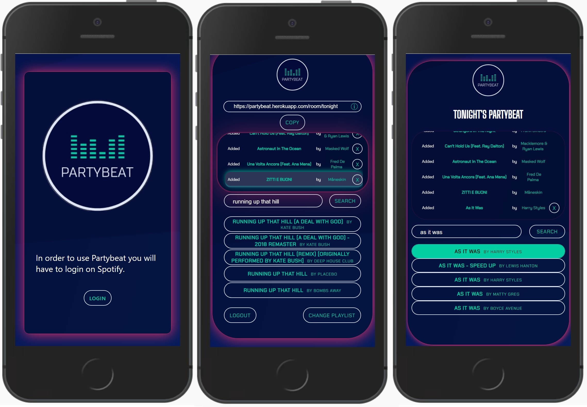

# Partybeat

<div align=center>

</div>
Partybeat is a web-app fully responsive for phones that allow you to create live customizable spotify playlists.
Everybody connect to you allowing them to add a new song.
The perfect way to actually listen to a beat during a party.

# Screenshots

<table>
  <tr>
    <td valign="top"></td>
    <td valign="top"></td>
  </tr>
</table>

# Installation

1.- Clone the repo and join it

```bash
git clone https://github.com/Nachcoll/partybeat.git
cd client
```

2.- Change the deployment-url.ts url to http://localhost:3000. File location = ./client/src/utils/deployment-url.ts

```bash
const frontURL = `http://localhost:3000`
```

3.- Create .env file in server with your Spotify dashboard credentials

```bash
CLIENT_ID='YOUR_CLIENT_ID_HERE'
CLIENT_SECRET='YOUR_SECRET_KEY_HERE'
```

# Build with

- React Typescript
- Express
- Socket.io
- Spotify API
- Deployed with Heroku

## Cheers!
